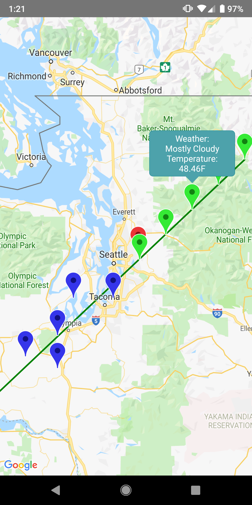

# _Weather Warning_

#### _Weather Warning Android App_

#### By _Young Liu_

## Description

_Weather app written in React Native that predicts where you're going to be in the future based on past location data, and warns you of inclement weather where you will be (rather than where you are)._

## Images:

## Specifications

- _App will log users past locations, storing them in a queue. Location data is stored locally._
- _Length of time app will keep past locations for and frequency of logging will be specified by the user._
- _App will calculate a regression based on these past location data._
- _App will poll the weather data using the Dark Sky Weather API at your current location, and locations along the area of the predicted trajectory._
- _Anywhere among the predicted locations that have inclement will trigger a push notification warning to the user._

## Setup/Installation Requirements

- _Clone this Repository (\$ git clone https://github.com/youngzliu/WeatherWarning name)_
- _Ensure that you have the proper dependencies installed for React Native CLI (Visit https://facebook.github.io/react-native/docs/getting-started for more details)_
- _Change into the work directory (\$ cd Weather Warning)_
- _To edit the project, open the project in your preferred text editor._
- _Run the command \$ npm install_
- _Run the command \$ react-native run-android_

## Technologies Used

_This website was created using React, React Native, the Google Maps API and the Dark Sky API._

### License

_MIT License_

_Copyright (c) 2019 Young Liu_

_Permission is hereby granted, free of charge, to any person obtaining a copy of this software and associated documentation files (the "Software"), to deal in the Software without restriction, including without limitation the rights to use, copy, modify, merge, publish, distribute, sublicense, and/or sell copies of the Software, and to permit persons to whom the Software is furnished to do so, subject to the following conditions:_

_The above copyright notice and this permission notice shall be included in all copies or substantial portions of the Software._

_THE SOFTWARE IS PROVIDED "AS IS", WITHOUT WARRANTY OF ANY KIND, EXPRESS OR IMPLIED, INCLUDING BUT NOT LIMITED TO THE WARRANTIES OF MERCHANTABILITY, FITNESS FOR A PARTICULAR PURPOSE AND NONINFRINGEMENT. IN NO EVENT SHALL THE AUTHORS OR COPYRIGHT HOLDERS BE LIABLE FOR ANY CLAIM, DAMAGES OR OTHER LIABILITY, WHETHER IN AN ACTION OF CONTRACT, TORT OR OTHERWISE, ARISING FROM, OUT OF OR IN CONNECTION WITH THE SOFTWARE OR THE USE OR OTHER DEALINGS IN THE SOFTWARE._
